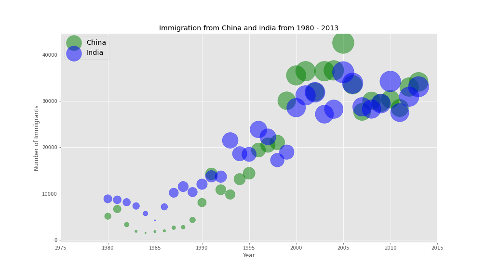
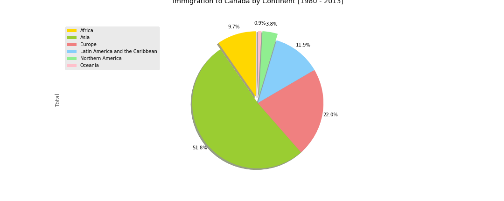

# Data visulization with Matplotlib

## Table of Contents
* [General Info](#general-information)
* [Results](Results)
* [Technologies Used](#technologies-used)
* [Contact](#contact)
<!-- * [License](#license) -->

## General Information
- My attempts at using Matplotlib to learn data visulization with Python.
- Contains simple plots like: line plot, pie plot, box chart, bubble plot, area plot, ...

## Results

## Technologies Used
- Python
- Pandas
- Matplotlib

## Contact
Created by [Miralireza Nabavi](anabavib@asu.edu) - feel free to contact me!
